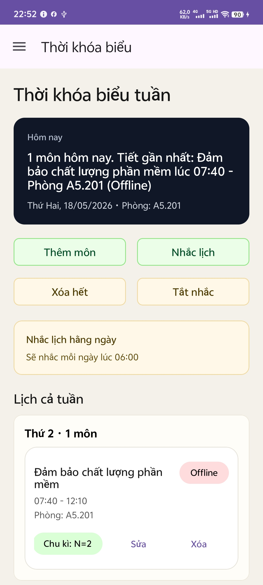
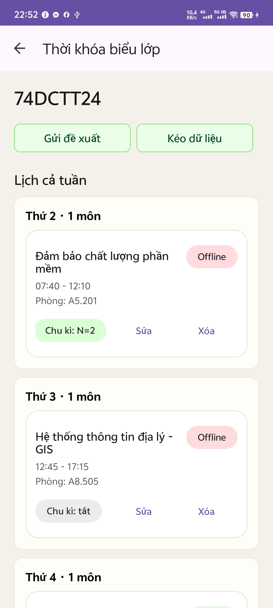
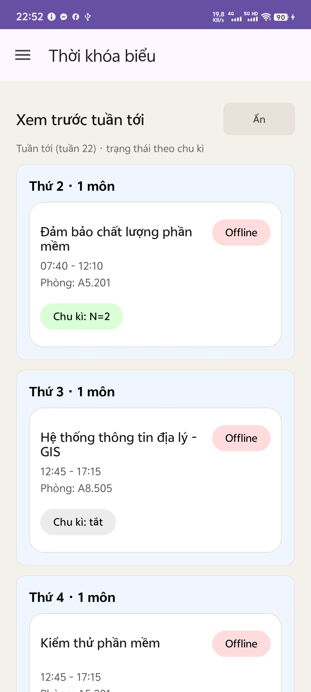

# 📚 Timetable App - Quản Lý Thời Khóa Biểu Thông Minh

Ứng dụng Android giúp sinh viên quản lý thời khóa biểu hàng tuần một cách dễ dàng và hiệu quả. Với giao diện trực quan và các tính năng thông minh, bạn sẽ không bao giờ quên lịch học nữa!

## ✨ Tính Năng Chính

### 📅 Quản Lý Thời Khóa Biểu Cá Nhân
- **Thêm/Sửa/Xóa môn học** dễ dàng cho từng ngày trong tuần
- **Thông tin chi tiết** cho mỗi môn học:
  - Tên môn học
  - Phòng học/địa điểm
  - Trạng thái học: Online 🔴 hoặc Offline 🟢
  - Ghi chú cá nhân
- **Chu kỳ học thông minh**: Tự động chuyển đổi trạng thái Online/Offline theo tuần (hỗ trợ sinh viên học nhiều lớp với lịch xen kẽ)
- **Xem trước tuần sau**: Dễ dàng xem lịch của tuần tiếp theo

### 🔔 Thông Báo Nhắc Học
- **Nhắc học tự động** với thời gian tùy chỉnh
- **Nội dung thông báo chi tiết**: Hiển thị môn học, phòng học, thứ trong ngày
- **Tự động khởi động lại** sau khi khởi động máy

### 🔍 Tìm Kiếm & Chia Sẻ Thời Khóa Biểu Lớp
- **Tìm kiếm thời khóa biểu lớp** theo tên lớp
- **Xem thời khóa biểu mẫu** của các lớp đã được chia sẻ
- **Import nhanh**: Áp dụng thời khóa biểu lớp vào lịch cá nhân chỉ với 1 chạm
- **Chỉnh sửa linh hoạt**: Tùy chỉnh thời khóa biểu import theo nhu cầu cá nhân

### 🤝 Đóng Góp Cộng Đồng
- **Gửi đề xuất chỉnh sửa** thời khóa biểu lớp
- **Theo dõi trạng thái** đề xuất (Chờ duyệt ✅ / Đã chấp nhận ✔️ / Từ chối ❌)

### 🔐 Quản Trị Viên (Admin Panel)
- **Xác thực admin** bằng mã bảo mật
- **Quản lý đề xuất**: Xem, phê duyệt hoặc từ chối các đề xuất chỉnh sửa thời khóa biểu
- **Badge thông báo**: Hiển thị số lượng đề xuất chờ duyệt

## 🎯 Giao Diện Ứng Dụng

## 🎯 Giao Diện Ứng Dụng

### Màn Hình Chính (Home)


- Hiển thị thời khóa biểu tuần hiện tại dạng card trực quan
- Đồng hồ hiện tại và tóm tắt lịch học hôm nay
- Các nút thao tác nhanh: Thêm môn học, Đặt nhắc, Xóa tất cả
- Navigation Drawer để truy cập tìm kiếm lớp và cài đặt

### Quản Lý Môn Học


- Thêm, sửa, xóa môn học dễ dàng
- Thiết lập thông tin chi tiết: tên môn, phòng học, giờ học, trạng thái Online/Offline

### Tính Năng Nổi Bật


- Tìm kiếm và import thời khóa biểu lớp
- Gửi đề xuất chỉnh sửa
- Thông báo nhắc học thông minh

### Tùy Chọn Bổ Sung


- Cài đặt thông báo
- Xem trước tuần sau
- Quản lý đề xuất (Admin)

## 🛠 Công Nghệ Sử Dụng

- **Ngôn ngữ**: Kotlin
- **Kiến trúc**: MVVM với Fragment
- **UI Components**: Material Design 3
- **Database**: Room Database (SQLite)
- **Backend**: Firebase Realtime Database
- **Notifications**: AlarmManager & BroadcastReceiver
- **Navigation**: Jetpack Navigation Component

## 📱 Yêu Cầu Hệ Thống

- Android 6.0 (API level 23) trở lên
- Quyền truy cập:
  - `POST_NOTIFICATIONS`: Gửi thông báo nhắc học
  - `RECEIVE_BOOT_COMPLETED`: Tự động khởi động thông báo sau khi reboot
  - `SCHEDULE_EXACT_ALARM`: Lên lịch thông báo chính xác
  - `INTERNET` & `ACCESS_NETWORK_STATE`: Kết nối Firebase

## 🚀 Cài Đặt & Xây Dựng

```bash
# Clone repository
git clone <repository-url>

# Mở project bằng Android Studio
# Sync Gradle và build
./gradlew assembleDebug

# Cài đặt APK trên thiết bị
adb install app/build/outputs/apk/debug/app-debug.apk
```

## 📖 Hướng Dẫn Sử Dụng

### Thiết Lập Thời Khóa Biểu Đầu Tiên
1. Mở ứng dụng, nhấn nút **"Thêm môn học"**
2. Điền thông tin: Tên môn, phòng học, giờ bắt đầu/kết thúc
3. Chọn trạng thái học (Online/Offline)
4. Nếu học theo chu kỳ, bật **"Chu kỳ"** và thiết lập tuần bắt đầu
5. Nhấn **"Lưu"** để hoàn tất

### Đặt Thông Báo Nhắc Học
1. Nhấn nút **"Đặt nhắc"** trên màn hình chính
2. Chọn giờ muốn nhận thông báo
3. Cấp quyền thông báo khi được yêu cầu
4. Ứng dụng sẽ gửi nhắc nhở mỗi ngày vào giờ đã chọn

### Tìm Và Import Thời Khóa Biểu Lớp
1. Mở Navigation Drawer, chọn **"Tìm kiếm lớp"**
2. Nhập tên lớp cần tìm
3. Chọn lớp từ kết quả tìm kiếm
4. Xem thời khóa biểu và nhấn **"Import"** để áp dụng vào lịch cá nhân
5. Tùy chỉnh thêm nếu cần

### Gửi Đề Xuất Chỉnh Sửa
1. Sau khi chỉnh sửa thời khóa biểu lớp
2. Nhấn **"Gửi đề xuất"**
3. Mô tả thay đổi và xác nhận gửi
4. Theo dõi trạng thái trong phần Cài đặt (nếu là admin)

## 📝 Lưu Ý

- Chu kỳ học được tính dựa trên tuần trong năm, hỗ trợ các lớp có lịch học xen kẽ
- Dữ liệu được lưu cục bộ trên thiết bị và đồng bộ với Firebase khi có kết nối
- Admin code mặc định: `1234` (nên thay đổi trong production)

## 🤝 Đóng Góp

Mọi đóng góp về tính năng hoặc báo cáo lỗi đều được chào đón! Vui lòng tạo issue hoặc pull request trên repository.

## 📄 License

Dự án mã nguồn mở, tự do sử dụng cho mục đích học tập và cá nhân.

---

**Phát triển với ❤️ bởi UZUU Team**
